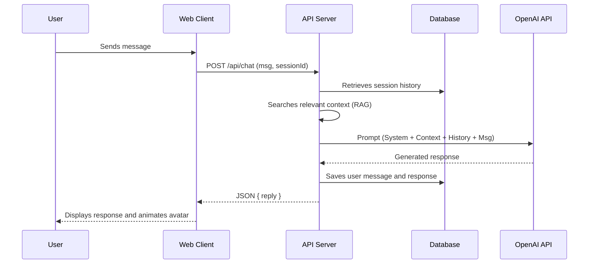
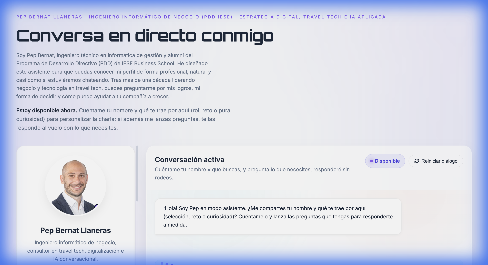
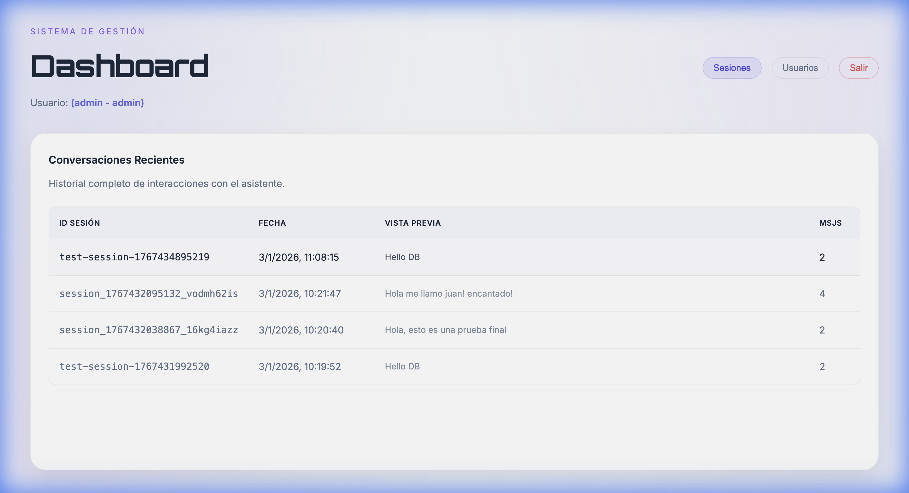

# Interactive Bio AI

Conversational personal assistant with interactive avatar and artificial intelligence (RAG + OpenAI). This project demonstrates a modern, clean, and scalable full-stack architecture.

**🔴 Live Demo**: [https://www.pepbernat.es](https://www.pepbernat.es)

## 📋 Description

This project implements a smart chat capable of answering questions about a professional profile (in this case, Pep Bernat) using a Markdown knowledge base (`knowledge.md`) and **RAG (Retrieval-Augmented Generation)** techniques. It includes an interactive frontend with an avatar that reacts to user input and an administration panel to view conversation history.

## ✨ Features

- **Conversational Interface**: Real-time chat with answers generated by AI.
- **Interactive Avatar**: Visual feedback (thinking, speaking) for an enhanced UX.
- **RAG (Semantic Search)**: Responses are grounded in a local knowledge document (`knowledge.md`), reducing hallucinations and fully personalizing the content.
- **Admin Panel**: Protected dashboard to visualize sessions and metrics.
- **Clean Architecture**: Clear separation between Client, Server, and Data.
- **Docker Ready**: Fully prepared for container deployment.

## 🛠 Architecture

The system follows a classic client-server architecture with an integrated AI module.

```mermaid
graph TD
    User[User] -->|HTTPS| Frontend[Client (HTML/JS)]
    Frontend -->|REST API| Backend[Node.js Express Server]
    
    subgraph "Backend System"
        Backend -->|Auth| JWT[JWT Service]
        Backend -->|Persistence| SQLite[(SQLite DB)]
        Backend -->|Search| RAG[Embeddings Module]
        RAG -->|Context| Knowledge[knowledge.md]
        RAG -->|Vectors| Cache[.embeddings_cache.json]
    end
    
    Backend -->|Chat Completion| OpenAI[OpenAI API]
```

### Conversation Flow



## 📸 Screenshots

### Client View

The main interface where users interact with the assistant.


### Admin Dashboard

Protected panel to review conversations and statistics.


## 🚀 Installation & Usage

### Prerequisites

- Node.js v20+
- OpenAI API Key (in `.env`)

### Local Execution

1. **Install dependencies**:

    ```bash
    npm install
    ```

2. **Environment Setup**:
    Create an `.env` file based on the example or ensure you have:

    ```env
    OPENAI_API_KEY=sk-...
    JWT_SECRET=your_secret
    ```

3. **Build the frontend**:

    ```bash
    npm run build
    ```

    This will generate the `public/` folder with optimized assets.

4. **Start the server**:

    ```bash
    npm start
    ```

    Access `http://localhost:3000`.

### Using Docker

1. **Build image**:

    ```bash
    docker build -t interactive-bio-ai .
    ```

2. **Run container**:

    ```bash
    docker run -p 3000:3000 --env-file .env interactive-bio-ai
    ```

## 📂 Project Structure

```
.
├── client/          # Frontend source code (HTML, CSS, JS)
├── src/             # Backend logic (DB, Embeddings)
├── scripts/         # Build and test tools
├── server.js        # Express server entry point
├── knowledge.md     # Knowledge base for RAG
├── Dockerfile       # Docker configuration
└── package.json     # Dependencies and scripts
```

## 📝 License

This project is licensed under the **Creative Commons Attribution-NonCommercial 4.0 International (CC BY-NC 4.0)** license.
You are free to use this code for educational and personal purposes, but **commercial use is strictly prohibited**.

See the [LICENSE](LICENSE) file for more details.
